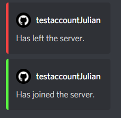
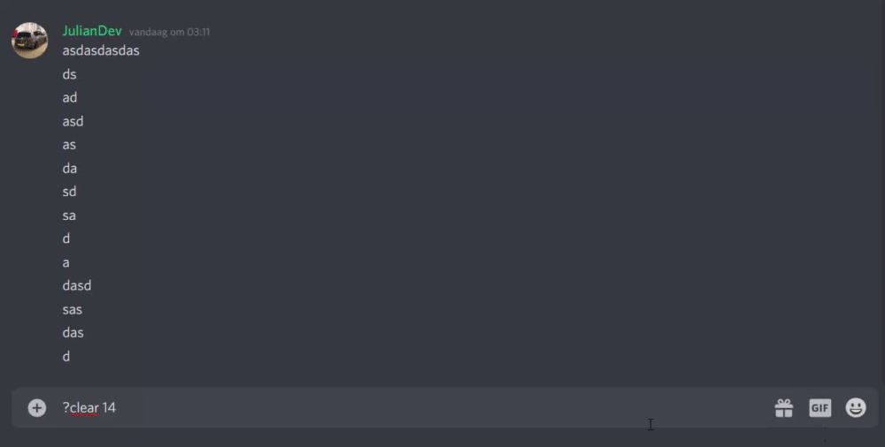

# SimpleBot
A simple bot for you're own Discord server.

What can this **SimpleBot** do? 

- When a user joins or leave the server it will send a message to a channel.
- It will delete messages with the `?clear [number]` command.

*The [number] needs to be set to the amount of messages you want to delete.*

This project might not be continued to development. 

# How to use

**1.** Download this project. 
**2.** Upload this project to your environment 
**3.** Run `npm install` to install the needed dependencies. 
**5.** Go to the `config.json` file and set your Discord bot token and channel ID. 
**6.** Open cmd and go to the project folder. 
**7.** Run `node simple.js` to activate the bot.

# Preview

# Dependencies

- discord.js
- moment
- moment-duration,
- moment-duration-format
- ms

# Sponser me

GitHub: https://github.com/sponsors/Julianvschijndel 
PayPal: https://www.paypal.me/juliandevnl 
Buy me a coffee: https://www.buymeacoffee.com/JulianDev 
 
Bitcoin: 1HACXLLGQZQj2zB5NheztA1bdsdQZwHxmh 
Ethereum: 0x5EAc4d7a1B6AF4E4F7BA2f780beCe8811D5aC225 
BAT: 0x5EAc4d7a1B6AF4E4F7BA2f780beCe8811D5aC225 
